# OpenWrt 虚拟机搭建

## 实验目的

* 熟悉基于 OpenWrt 的无线接入点（AP）配置
* 为第二章、第三章和第四章实验准备好「无线软 AP」环境

## 实验环境

* 可以开启监听模式、AP 模式和数据帧注入功能的 USB 无线网卡
* Virtualbox

## 实验要求

- [x] 对照 [第一章 实验](exp.md) `无线路由器/无线接入点（AP）配置` 列的功能清单，找到在 OpenWrt 中的配置界面并截图证明；
- [x] 记录环境搭建步骤；
- [x] 如果 USB 无线网卡能在 `OpenWrt` 中正常工作，则截图证明；
- [x] 如果 USB 无线网卡不能在 `OpenWrt` 中正常工作，截图并分析可能的故障原因并给出可能的解决方法。

## 实验记录

### OpenWrt 中的配置界面

* 重置和恢复AP到出厂默认设置状态

  

* 设置AP的管理员用户名和密码

  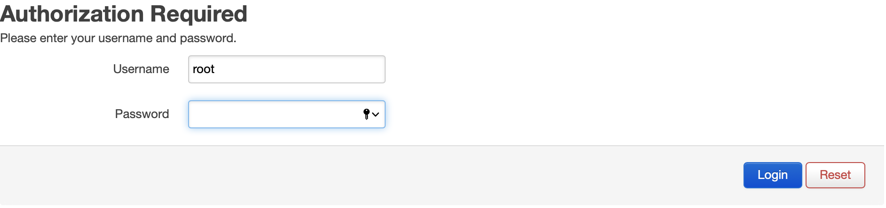

* 设置SSID广播和非广播模式

  

* 配置不同的加密方式

  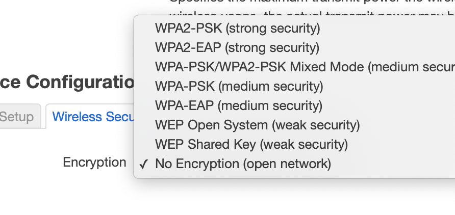

* 设置AP管理密码

  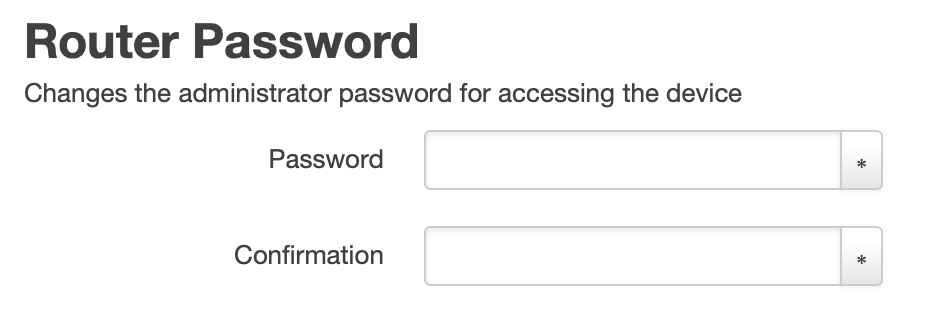

* 配置无线路由器使用自定义的DNS解析服务器 

  

* 配置DHCP和禁用DHCP

  

* 开启路由器/AP的日志记录功能（对指定事件记录）

  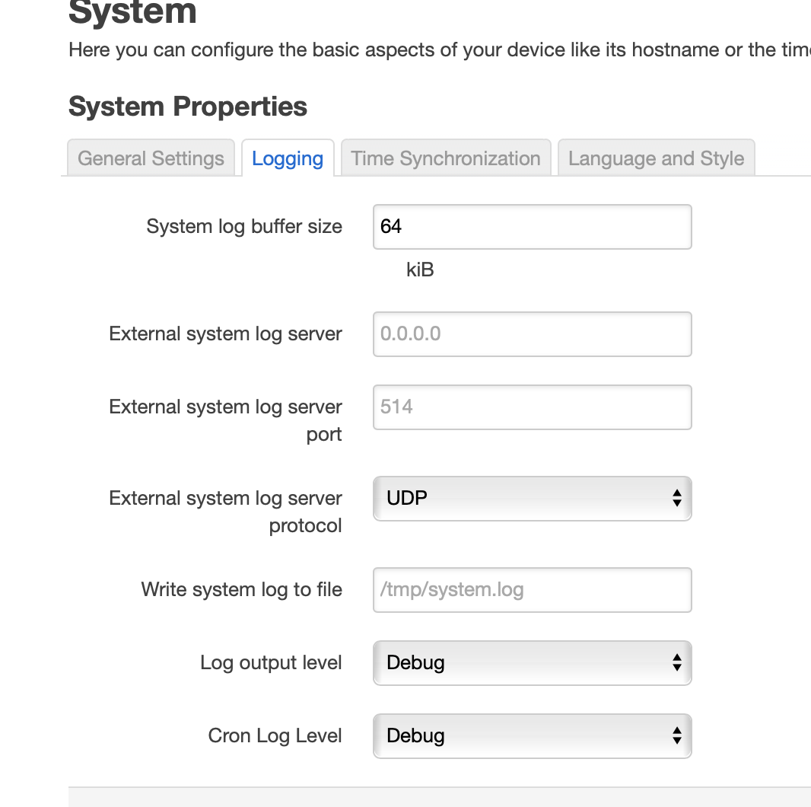

* 配置AP隔离(WLAN划分)功能

  功能.png)

* 设置MAC地址过滤规则（ACL地址过滤器）

  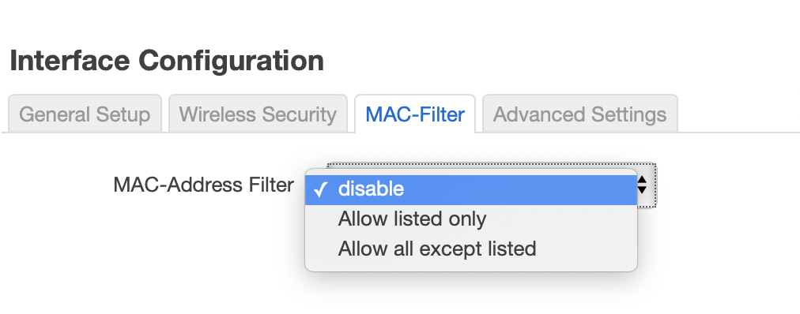

* 查看WPS功能的支持情况

  没有找到该功能

* 查看AP/无线路由器支持哪些工作模式

  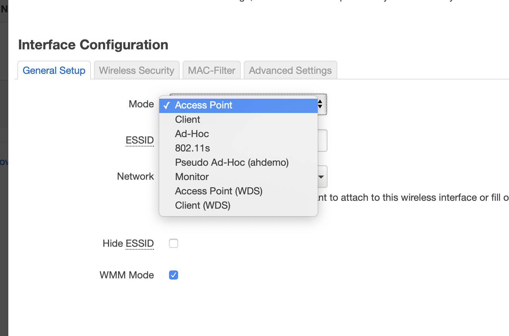

### 环境搭建步骤

- 从官网下载下载镜像文件[openwrt-19.07.5-x86-64-combined-squashfs.img.gz](https://downloads.openwrt.org/releases/19.07.5/targets/x86/64/openwrt-19.07.5-x86-64-combined-squashfs.img.gz)，更名为 openwrt-x86-64-combined-squashfs.img.gz

- 解压缩

- 执行[setup-myvm.sh](setup-myvm.sh)

  - img 格式转换为 Virtualbox 虚拟硬盘格式 vdi

  - 创建虚拟机

    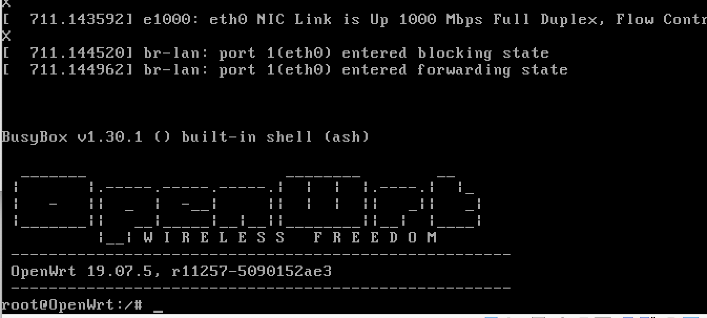

- 修改 OpenWrt 局域网地址为当前 Host-only 网段内可用地址

  ```ini
  config interface 'lan'
  	option type 'bridge'
  	option ifname 'eth0'
  	option proto 'static'
  	option ipaddr '192.168.56.11' 
  	option netmask '255.255.255.0'
  	option ip6assign '60'
  ```

- 通过 `ifdown lan && ifup lan` 完成指定网卡 `lan` 的重新加载配置生效

- 安装`LuCi`软件包

  ```bash
  # 更新 opkg 本地缓存
  opkg update
  # 安装 luci
  opkg install luci
  ```

  安装好 `LuCi` 后通过浏览器访问管理 `OpenWrt` 的效果截图

  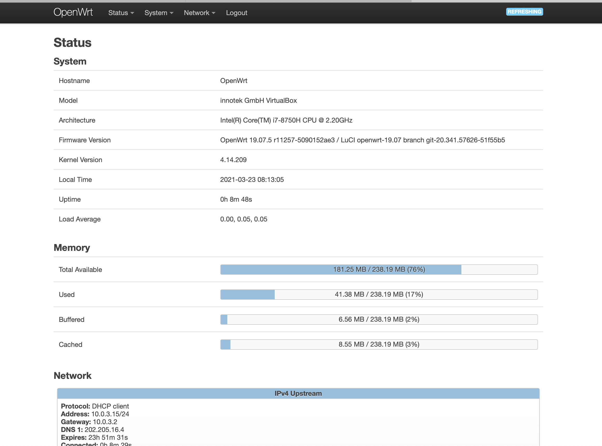

###  USB 无线网卡能在 `OpenWrt` 中正常工作

- 在OpenWrt中安装无线网卡相关的驱动程序

  ```bash
  # 每次重启 OpenWRT 之后，安装软件包或使用搜索命令之前均需要执行一次 opkg update
  opkg update && opkg install usbutils
  ```

- 确定该无线网卡的驱动是否已经安装好

  ```bash
  # 查看 USB 外设的标识信息
  lsusb
  
  # 查看 USB 外设的驱动加载情况
  lsusb -t
  ```

  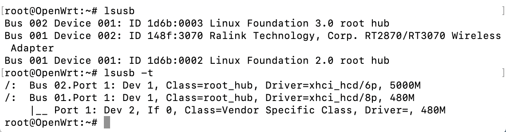

  可以看出，芯片名称为 `RT2870/RT3070` 的无线网卡未加载到匹配的驱动。

- 安装相应驱动

  ```bash
  opkg find kmod-* | grep 3070
  # kmod-gigaset - 4.14.209-1 - This driver supports the Siemens Gigaset SX205/255 family of ISDN DECT bases, including the predecessors Gigaset 3070/3075 and 4170/4175 and their T-Com versions Sinus 45isdn and Sinus 721X.
  opkg install kmod-gigaset
  
  opkg find kmod-* | grep 2870
  #kmod-rt2800-usb - 4.14.209+4.19.137-1-2 - Ralink Drivers for RT2x00 cards (RT2870 USB)
  opkg install kmod-rt2800-usb
  ```

  

- 再次执行 `ifconfig -a` ,验证系统当前已经可以识别无线网卡

  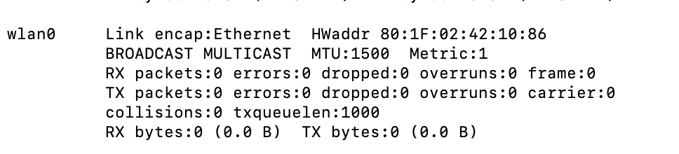

- 登入`LuCi`配置无线网络

  -  `Interface Configuration` 表单里 `Network` 勾选 `wan`

  - 手工指定监听信道和信号强度

  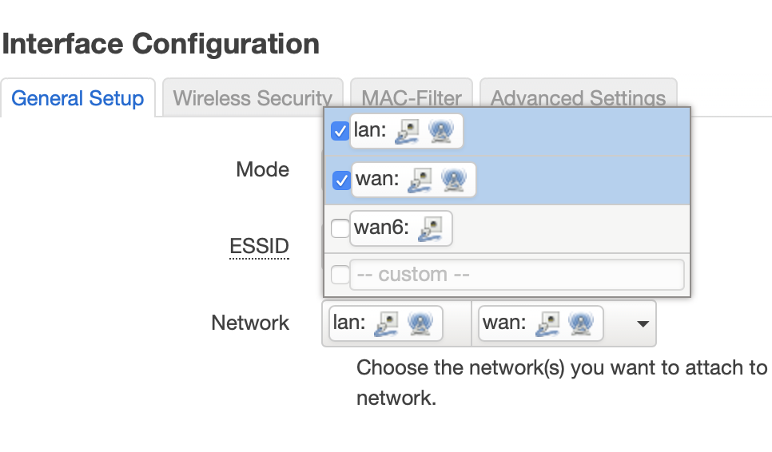

  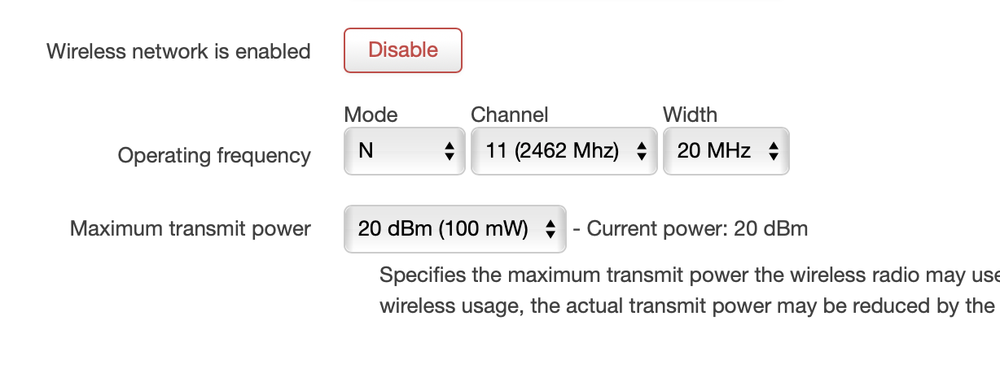

  - 点击 `Enable` 按钮启用当前无线网络

  - 没有客户端加入当前无线网络时

    

  - 有客户端加入当前无线网络时

    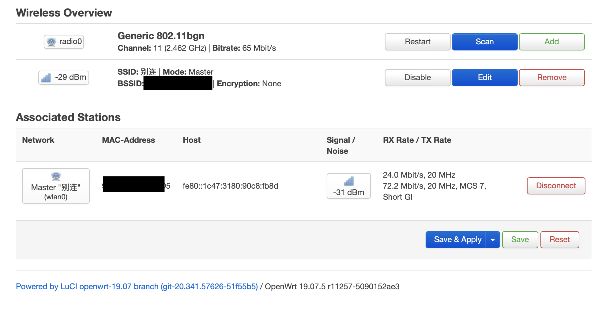

### 搭建时遇到的问题

- vb缺少扩展包

  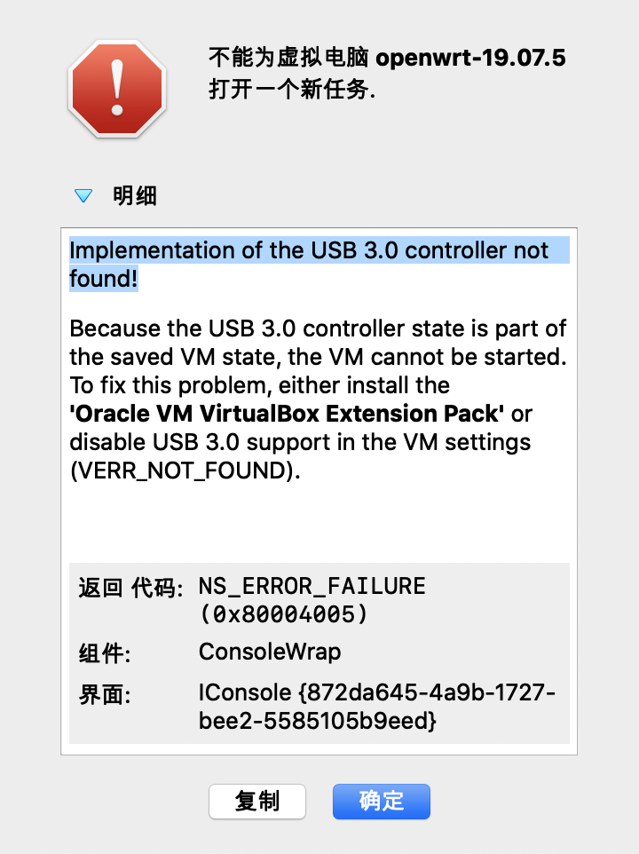

  **solution**

  在官网找到对应版本扩展包，安装

- img转换为vdi时报错`VBoxManage: error: VD: The given disk size 19444018 is not aligned on a sector boundary (512 bytes) ...`

  **solution**

  重新整合镜像` dd if=openwrt-x86-64-combined-squashfs.img of=openwrt-x86-64-combined-squashfs-padded.img bs=128000 conv=sync`，再进行转换

- 安装驱动后还是没有成功加载驱动

  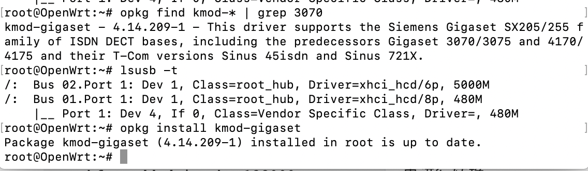

  **solution**

  用`opkg find kmod-* | grep wireless`查看 `openwrt` 支持哪些无线网卡驱动，发现没有`gigaset`，对应这个无线网卡特殊的名称，改用命令`opkg find kmod-* | grep 2870`，安装对于驱动`rt2800-usb`，成功！

- 登入 `LuCi` 之后在顶部菜单 `Network` 里没有发现 `Wireless` 

  **solution**

  重启就好

- 连上老师的OpenWrt后本机和自己的OpenWrt无法进行ssh连接，也无法ping通

  **solution**

  关闭了本机防火墙也解决不了.....结果本机重启就好了

  总结：把重启最牛打在公屏上！