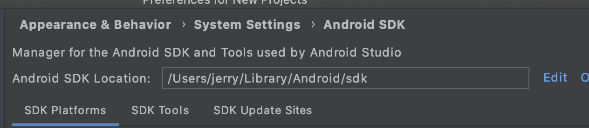
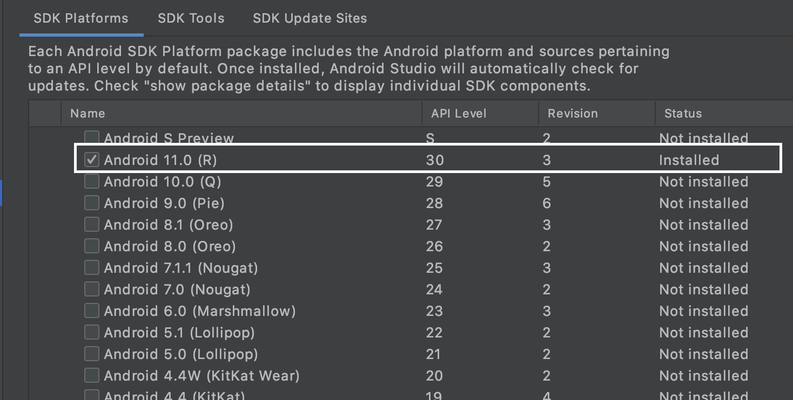
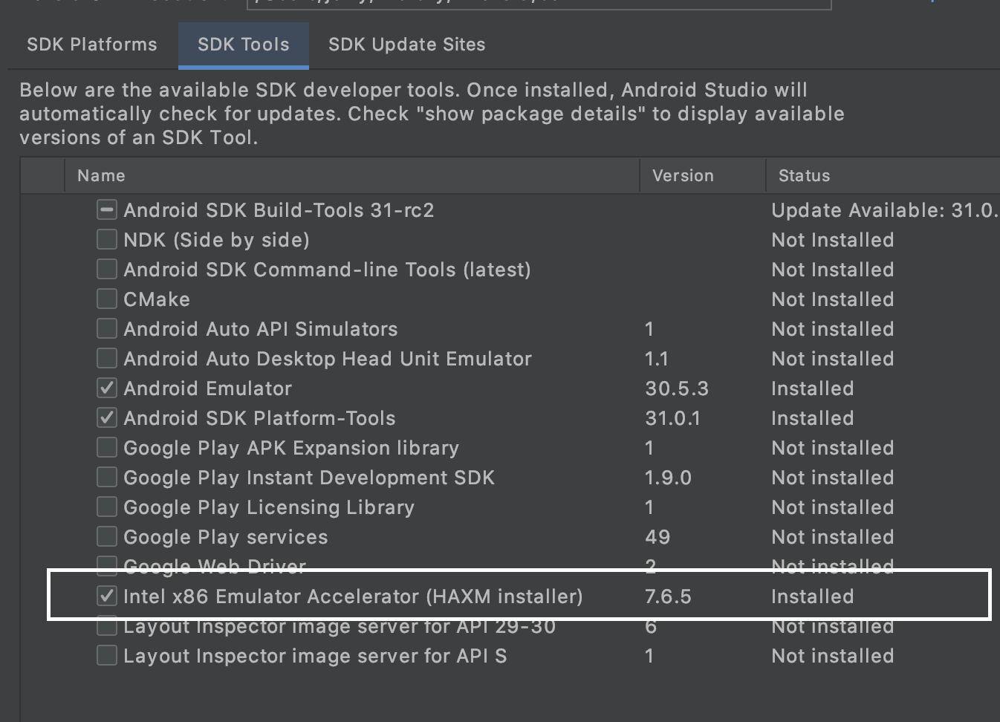
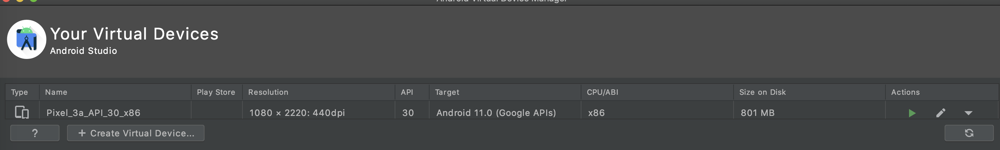
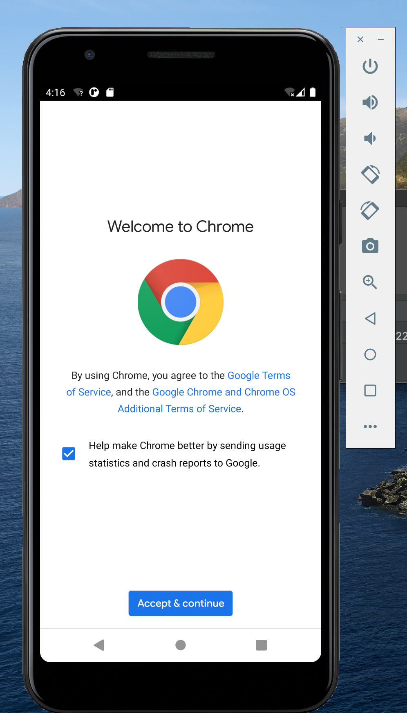
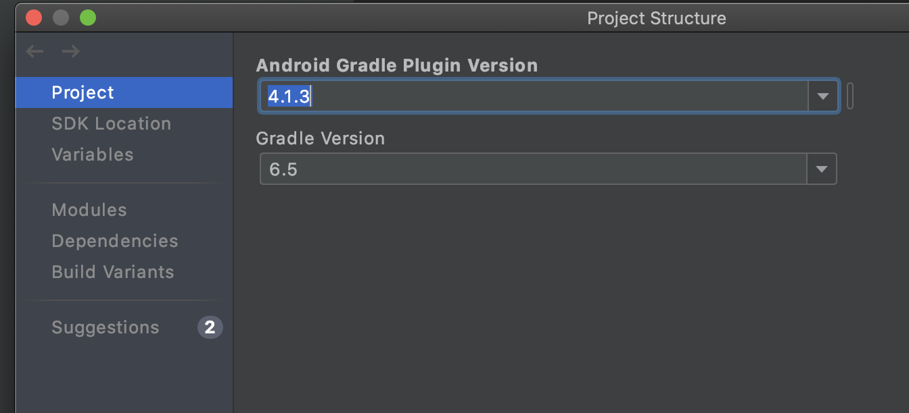

## 配置要求

- [x] 安装和配置 Java SDK 

- [x] 安装Android Studio

- [x] 下载安装 Android SDK

- [x] 配置 Android 模拟器运行环境

- [x] 配置 Gradle 编译环境

## 配置环境

- macOS 10.15.7

- Android Studio 4.1.3 for Mac

## 配置过程

### 安装和配置 Java SDK 

Android Studio 安装后已经内置了 Java 运行时环境，可以查看到 Android Studio 在编译当前项目时使用的 JDK 目录。

### 安装Android Studio

通过官方网站下载[Android Studio](https://developer.android.com/studio/) 并根据提示安装。

### 下载安装 Android SDK

- 在启动 Android Studio 之后可以通过启动界面的菜单选项 Configure -> SDK Manager 启动 SDK Manager 。

- SDK Manager 的 SDK Platforms 选项卡可以选择不同版本的 SDK 下载安装。

  

### 配置 Android 模拟器运行环境

- 安装 Intel x86 Emulator Accelerator (HAXM installer)

- 在 Android 模拟器上运行应用

  

  

  之前尝试过用Xcode制作一个iOS系统的翻牌小游戏，感觉和Android Studio的操作蛮类似的。

### 配置 Gradle 编译环境

* gradle 版本和 Android Studio Gradle 插件版本

  

* 使用 Android Studio 的内置 gradle 还是使用自己安装的 gradle

  内置

## 遇到的问题
无

## 参考文献
https://c4pr1c3.gitee.io/cuc-mis/chap0x05/exp.html

https://gradle.org
